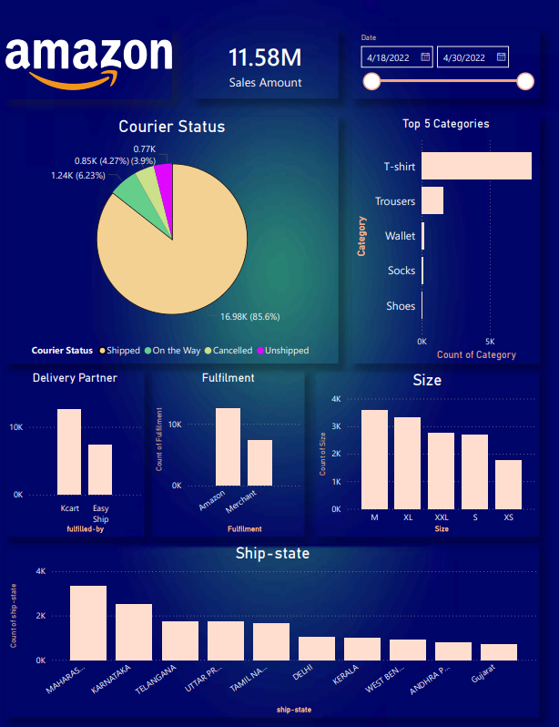

# OLA Analytics Dashboard

## Overview
The OLA Analytics Dashboard is an interactive Power BI project developed to analyze ride bookings, revenue performance, vehicle-wise trends, cancellation patterns, and customer ratings.

## Tools Used
- Power BI
- SQL
- Microsoft Excel
- Data Visualization
- Data Analysis

## Key Features
- Ride Booking Analysis
- Revenue Analysis
- Vehicle Type Performance
- Customer & Driver Cancellation Analysis
- Customer Rating Analysis
- Interactive Date Filters and Slicers
- Dynamic KPI Tracking

## Dashboard Pages

### 1. Overall Dashboard
Provides a complete overview of total bookings, booking value, booking status breakdown, and ride volume trends.

### 2. Vehicle Type Dashboard
Analyzes booking value, successful bookings, average distance travelled, and total distance travelled across different vehicle categories.

### 3. Revenue Dashboard
Tracks revenue by payment method, top customers, and ride distance trends.

### 4. Cancellation Dashboard
Identifies booking cancellations by customers and drivers along with major cancellation reasons.

### 5. Ratings Dashboard
Evaluates customer and driver ratings across different vehicle categories.

## Key Insights
- Analyzed over 20K ride bookings.
- Tracked booking success and cancellation patterns.
- Compared vehicle performance across multiple categories.
- Evaluated revenue contribution by payment methods.
- Identified major customer and driver cancellation reasons.
- Measured customer satisfaction through rating analysis.

## Dashboard Preview

## Author

**Shyam Sitapara**  
BCA (AI) Student | Power BI, SQL, Excel & Python | AI & Data Analytics Enthusiast
