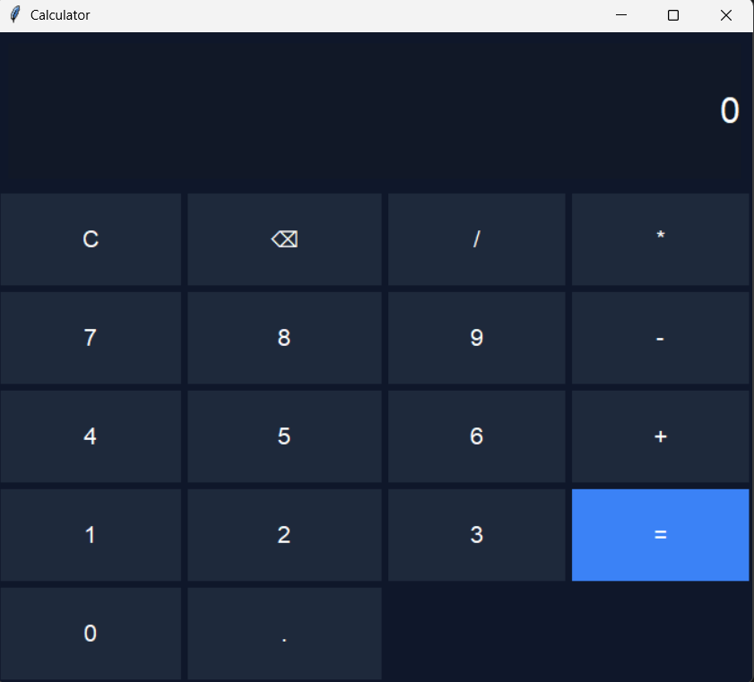

# 🧮 Calculator App (Python GUI)

## 📊 Project Overview

This is a modern Calculator application built using Python and Tkinter.
It supports basic arithmetic operations with both button clicks and keyboard input.

---

## 📸 Preview



---

## ⬇️ Download App

[Download Calculator](Quick_calculator.exe)

---

## 🚀 Features

* Basic operations (+, -, *, /)
* Clean modern dark UI
* Keyboard input support
* Clear (C) and Backspace (⌫) functionality
* Error handling

---

## 🛠️ Technologies Used

* Python 🐍
* Tkinter (GUI Library)

---

## 📂 Project Files

* `Quick_calculator.py` → Main Python file
* `Quick_calculator.exe` → Executable file
* `Calculator_UI.png` → UI screenshot

---

## ▶️ How to Run

### 🔹 Run Python File

```
python Quick_calculator.py
```

### 🔹 OR Run EXE File

Click the download link above and open:

```
Quick_calculator.exe
```

---

## 🎮 Controls

* Numbers: 0–9
* Operators: +, -, *, /
* Enter → Calculate
* Backspace → Delete last digit
* Escape → Clear

---

## 📌 Key Learning

* GUI development using Tkinter
* Event handling (keyboard + button)
* Layout management (grid system)
* Error handling in Python

---

## 👨‍💻 Author

**Shyam Sitapara**

---

## ⭐ Support

If you like this project, give it a ⭐ on GitHub!
