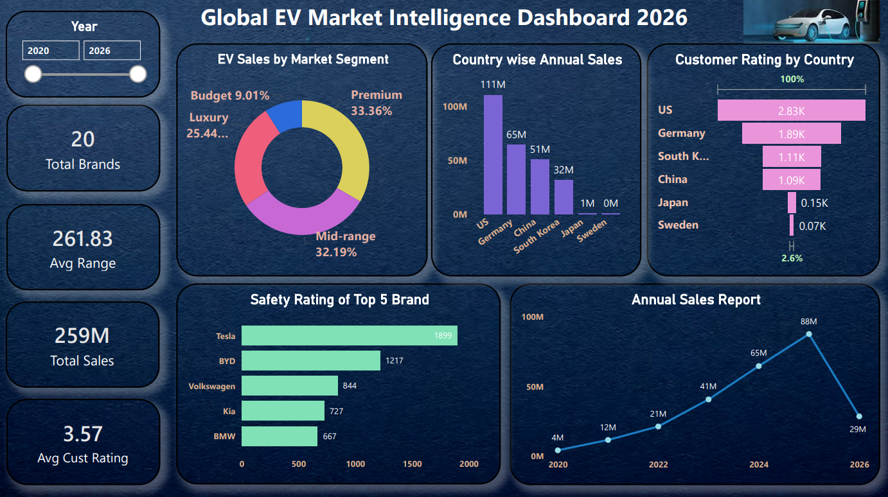

# ⚡ Global EV Market Intelligence Dashboard 2026

## 📌 Project Overview

The **Global EV Market Intelligence Dashboard 2026** is a Power BI project designed to analyze global Electric Vehicle (EV) market trends, sales performance, customer ratings, and brand insights.

This dashboard provides a comprehensive view of the EV industry across multiple countries and market segments, helping users understand market growth, customer preferences, and brand performance.

---

## 🎯 Objectives

* Analyze EV sales across different market segments.
* Compare annual sales performance by country.
* Evaluate customer ratings across global markets.
* Analyze safety ratings of top EV brands.
* Monitor annual EV sales trends.
* Create an interactive dashboard for business intelligence reporting.

---

## 📊 Dashboard Features

### Key Performance Indicators (KPIs)

* Total Brands: **20**
* Total Sales: **259M**
* Average Range: **261.83**
* Average Customer Rating: **3.57**

### Visualizations

* EV Sales by Market Segment
* Country-wise Annual Sales Analysis
* Customer Rating by Country
* Safety Rating of Top EV Brands
* Annual Sales Trend Report
* Interactive Year Filter

---

## 🌍 Business Insights

* Premium and Mid-range EV segments dominate market sales.
* The United States records the highest annual EV sales.
* Tesla leads in safety ratings among major EV brands.
* Customer satisfaction is strongest in the US and Germany.
* Global EV sales show significant growth between 2020 and 2025.

---

## 🛠 Tools & Technologies Used

* Power BI
* Microsoft Excel
* Data Cleaning
* Data Modeling
* Data Visualization
* Business Intelligence Reporting

---

## 📷 Dashboard Preview

---

## 📈 Skills Demonstrated

* Data Analytics
* Dashboard Development
* Business Intelligence
* Data Visualization
* KPI Design
* Report Building
* Analytical Thinking

---

## 👨‍💻 Author

**Shyam Sitapara**

BCA (AI) Student | Aspiring Data Analyst

### Connect With Me

* LinkedIn: [www.linkedin.com/in/shyam-sitapara](http://www.linkedin.com/in/shyam-sitapara)

---

⭐ If you found this project useful, consider giving it a star.
