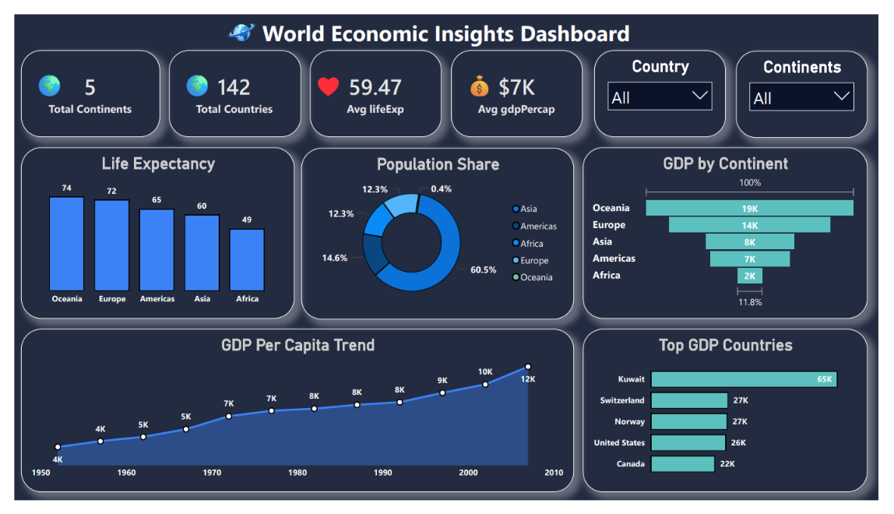

# 🌍 World Economic Insights Dashboard

  

## 📌 Project Overview

The **World Economic Insights Dashboard** is an interactive Power BI project designed to analyze global economic and demographic trends across countries and continents.

This dashboard provides valuable insights into GDP per capita, life expectancy, population distribution, and economic performance worldwide. It helps users understand economic growth patterns, compare continents, and identify countries with the highest GDP per capita.

---

## 🎯 Objectives

* Analyze GDP performance across continents
* Compare life expectancy among regions
* Understand global population distribution
* Track GDP growth trends over time
* Identify top-performing countries by GDP per capita

---

## 📊 Dashboard Features

### KPI Cards

* 🌎 Total Continents
* 🌍 Total Countries
* ❤️ Average Life Expectancy
* 💰 Average GDP Per Capita

### Interactive Filters

* Country Filter
* Continent Filter

### Visualizations

* GDP by Continent
* Population Share Analysis
* Life Expectancy Comparison
* GDP Per Capita Trend
* Top GDP Countries

---

## 📈 Key Insights

* Oceania has the highest average GDP per capita.
* Europe follows closely in economic performance.
* Asia accounts for the largest share of the global population.
* Life expectancy is generally higher in regions with stronger economic indicators.
* GDP per capita has shown a steady upward trend over the years.

---

## 🛠️ Tools & Technologies Used

* Power BI
* Power Query
* DAX
* Data Modeling
* Data Visualization

---

## 📂 Dataset Information

The dataset contains:

* Country
* Continent
* Year
* Population
* GDP Per Capita
* Life Expectancy

---

## 🎨 Dashboard Design

* Modern Dark Theme
* Interactive User Experience
* Business-Oriented Visualizations
* Clean Layout
* Portfolio-Ready Dashboard Design

---

## 🚀 Business Value

This dashboard enables users to:

* Monitor economic performance across regions
* Compare countries and continents
* Support data-driven decision-making
* Visualize long-term economic growth patterns

---

## 🔗 Connect With Me

### LinkedIn

[Shyam Sitapara](https://www.linkedin.com/in/shyam-sitapara)

---

## ⭐ Project Status

✅ Completed

If you found this project useful, feel free to connect with me and explore more data analytics projects.
