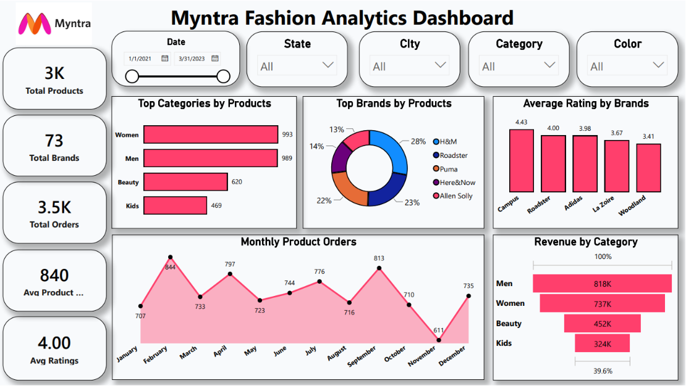

# 🛍️ Myntra Fashion Analytics Dashboard

## 📌 Project Overview

The **Myntra Fashion Analytics Dashboard** is an interactive Power BI project designed to analyze fashion product performance, customer preferences, brand ratings, pricing trends, and category-wise sales insights.

This dashboard helps businesses understand product demand, customer behavior, brand performance, and revenue contribution across different categories available on the Myntra platform.

---

## 🎯 Objectives

* Analyze product distribution across categories
* Evaluate brand performance and customer ratings
* Monitor monthly product order trends
* Compare revenue contribution by category
* Identify top-performing brands and product segments

---

## 📊 Dashboard Features

### KPI Cards

* 🛒 Total Products
* 🏷️ Total Brands
* 📦 Total Orders
* 💰 Average Product Price
* ⭐ Average Ratings

### Interactive Filters

* Date Filter
* State Filter
* City Filter
* Category Filter
* Color Filter

### Visualizations

* Top Categories by Products
* Top Brands by Products
* Average Rating by Brands
* Monthly Product Orders Trend
* Revenue by Category

---

## 📈 Key Insights

* Women's and Men's categories contribute the highest product count.
* H&M and Roadster are among the leading brands by product volume.
* Product orders show noticeable monthly fluctuations throughout the year.
* Higher-rated brands generally demonstrate stronger customer engagement.
* Revenue is concentrated in a few major product categories.

---

## 🛠️ Tools & Technologies Used

* Power BI
* Power Query
* DAX
* Data Modeling
* Data Visualization

---

## 📂 Dataset Information

The dataset includes fashion retail information such as:

* Product ID
* Category
* Sub-category
* Product Name
* Brand Name
* Size
* Color
* Ratings
* Customer Age
* City
* State
* Order Date
* Original Price
* Discount Percentage

---

## 🎨 Dashboard Design

* Myntra-Inspired Theme
* Interactive Filters and Navigation
* Clean Business-Oriented Layout
* Modern Data Visualization Techniques
* Portfolio-Ready Dashboard Design

---

## 🚀 Business Value

This dashboard enables businesses to:

* Understand customer preferences
* Track brand performance
* Optimize product pricing strategies
* Analyze category-level revenue trends
* Support data-driven merchandising decisions

---

## 🔗 Connect With Me

### LinkedIn

[Shyam Sitapara](https://www.linkedin.com/in/shyam-sitapara)

---

## ⭐ Project Status

✅ Completed

If you found this project interesting, feel free to connect with me and explore more Power BI, SQL, Excel, and Python analytics projects on my GitHub profile.
