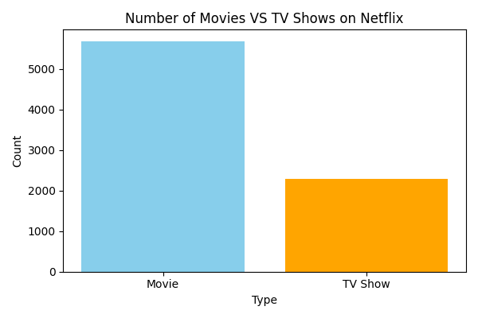
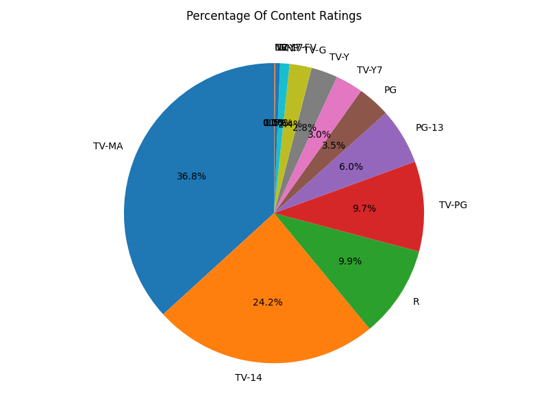
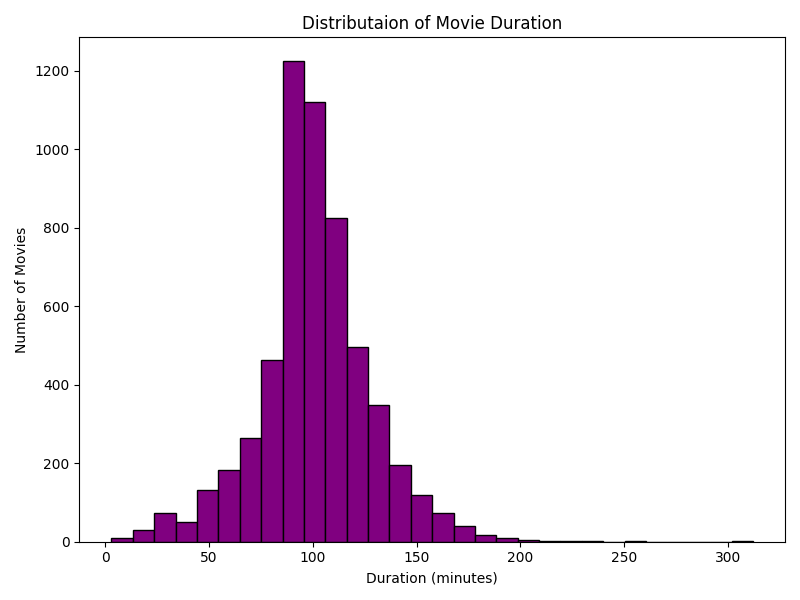
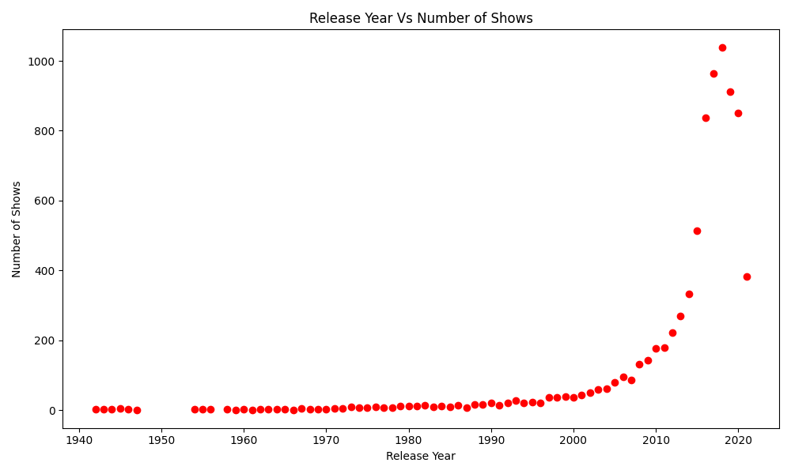
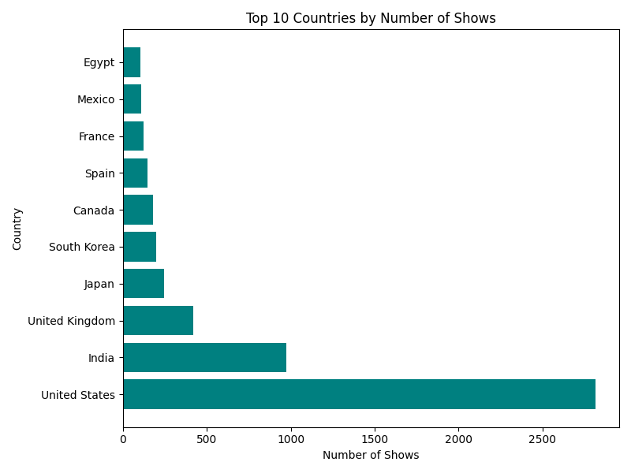
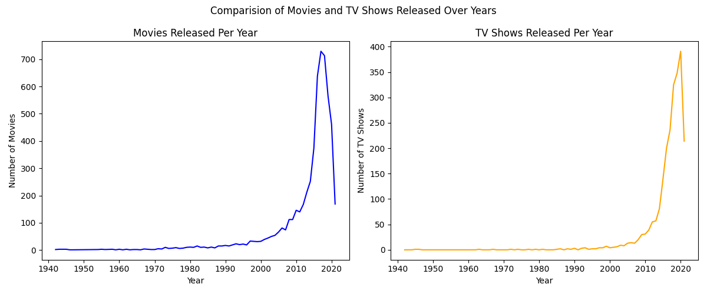

# 🎬 Netflix Data Analysis Project

## 📊 Project Overview

This project performs data analysis on Netflix dataset using Python.
It extracts meaningful insights and visualizes trends related to content available on Netflix.

---

## 🚀 Features

* Data Cleaning & Preprocessing
* Exploratory Data Analysis (EDA)
* Data Visualization using Matplotlib
* Insightful Graphs

---

## 🛠️ Technologies Used

* Python 🐍
* Pandas
* Matplotlib

---

## 📂 Dataset

* File: `netflix_titles.csv`

---

## 📈 Analysis & Visualizations

### 🎥 Movies vs TV Shows



---

### 🥧 Content Ratings Distribution



---

### ⏱️ Movie Duration Analysis



---

### 📅 Release Year Analysis



---

### 🌍 Top 10 Countries



---

### 📊 Movies vs TV Shows Over Time



---

## ▶️ How to Run

1. Install dependencies:

```
pip install pandas matplotlib
```

2. Run the script:

```
python Netfix_python.py
```

---

## 📌 Key Insights

* Movies dominate Netflix content
* TV-MA is the most common rating
* Most movies fall between 90–120 minutes
* Rapid growth after 2010
* United States produces the highest content

---

## 👨‍💻 Author

**Shyam Sitapara**

---

## ⭐ Support

If you like this project, give it a ⭐ on GitHub!
