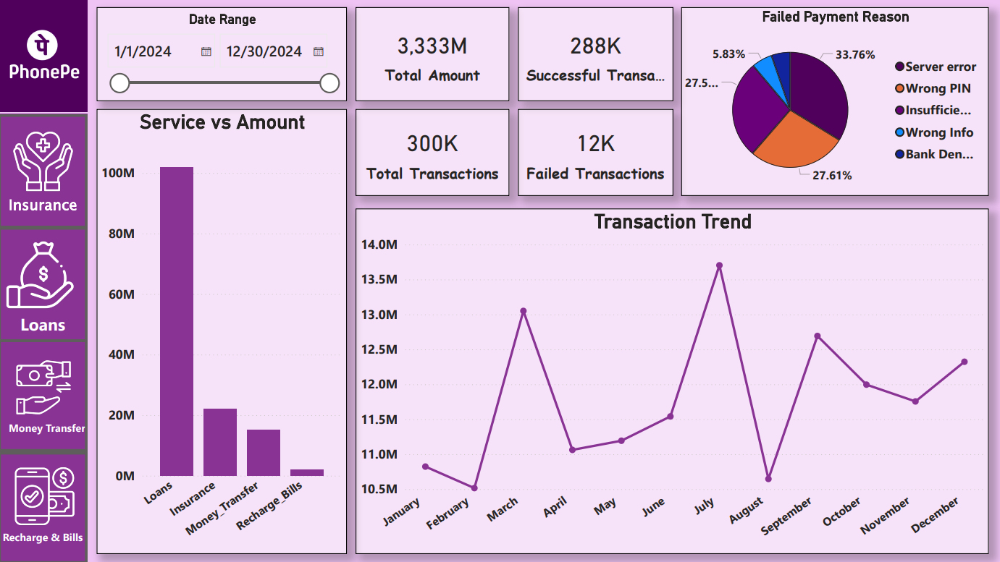
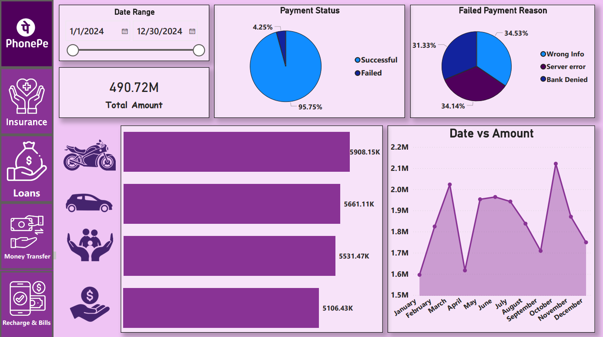
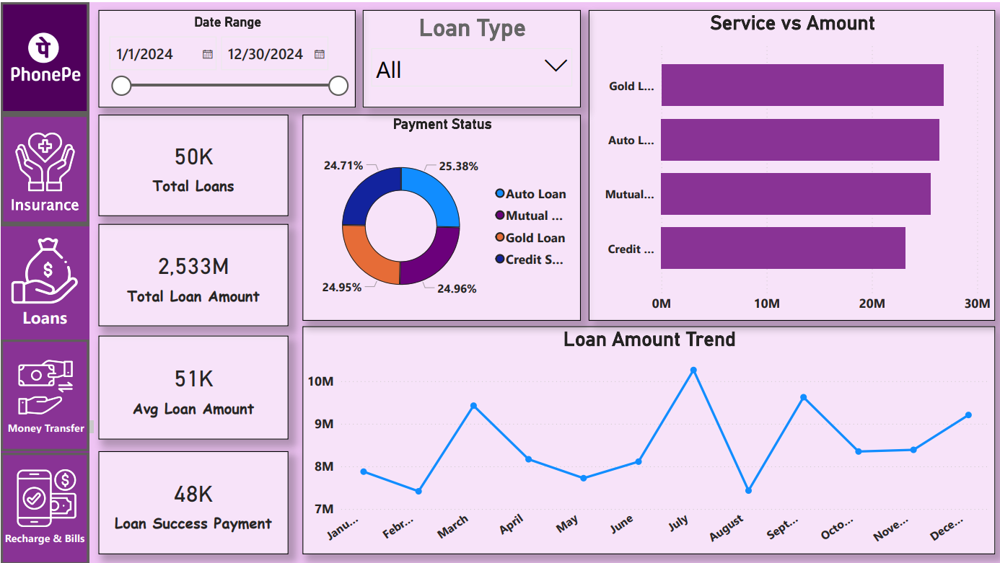
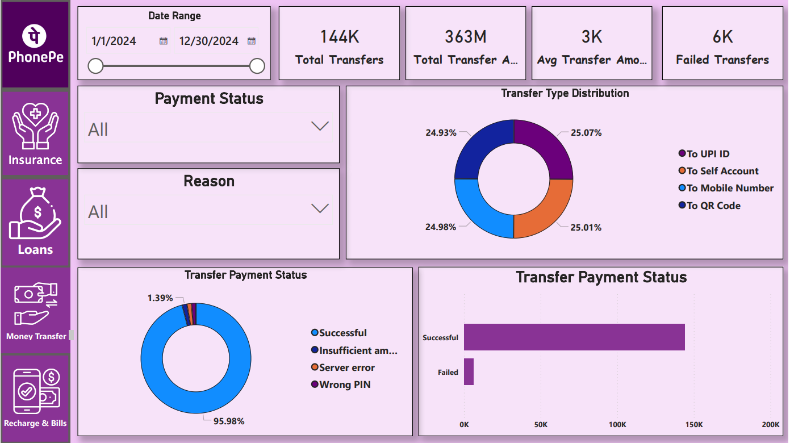
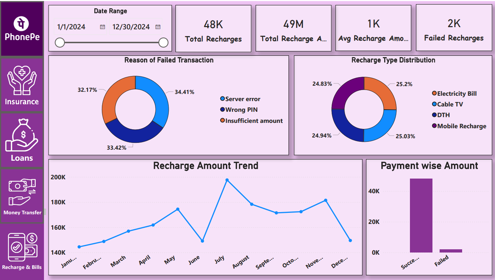

# PhonePe Analytics Dashboard

## Overview
Developed an interactive Power BI dashboard to analyze PhonePe transaction data across Insurance, Loans, Money Transfer, and Recharge & Bills services.

## Tools Used
- Power BI
- SQL
- Microsoft Excel

## Key Features
- KPI Cards for Total Amount, Total Transactions, Successful Transactions, and Failed Transactions
- Transaction Trend Analysis
- Service-wise Performance Analysis
- Payment Failure Analysis
- Interactive Filters and Slicers

## Dashboard Pages

### 1. Main Dashboard
Provides an overview of total transactions, transaction amount, success rate, failure reasons, and monthly transaction trends.

### 2. Insurance Dashboard
Analyzes insurance payments, transaction status, failure reasons, and insurance amount trends.

### 3. Loans Dashboard
Tracks loan amount, loan types, successful payments, average loan amount, and loan trends.

### 4. Money Transfer Dashboard
Monitors transfer amount, transfer types, payment status, failed transfers, and transfer distribution.

### 5. Recharge & Bills Dashboard
Analyzes recharge transactions, recharge amount trends, recharge types, and failed transaction reasons.

## Dashboard Preview

Contact Me:- linkedin.com/in/shyam-sitapara

## Author
Shyam Sitapara
BCA (AI) Student | AI & Data Analytics Enthusiast
