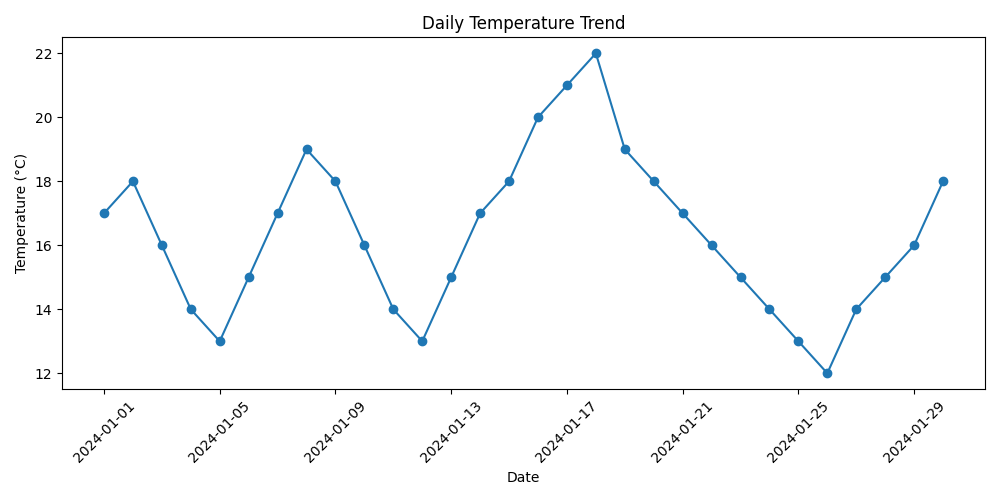
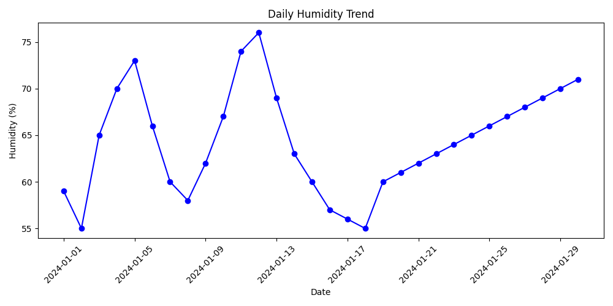
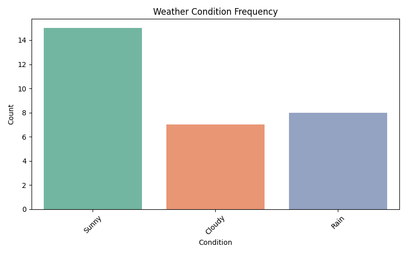
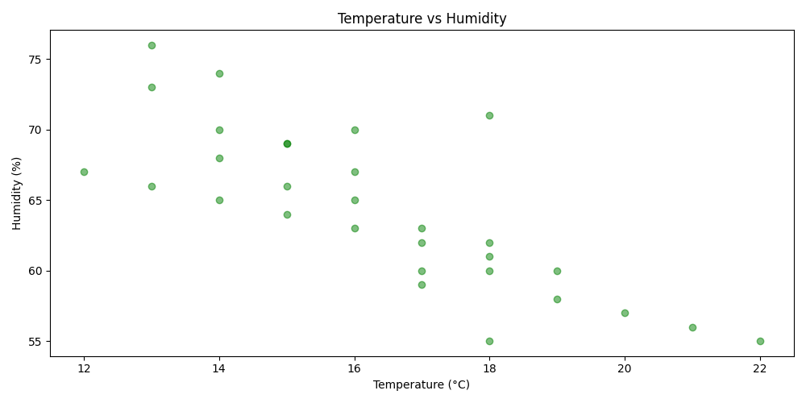
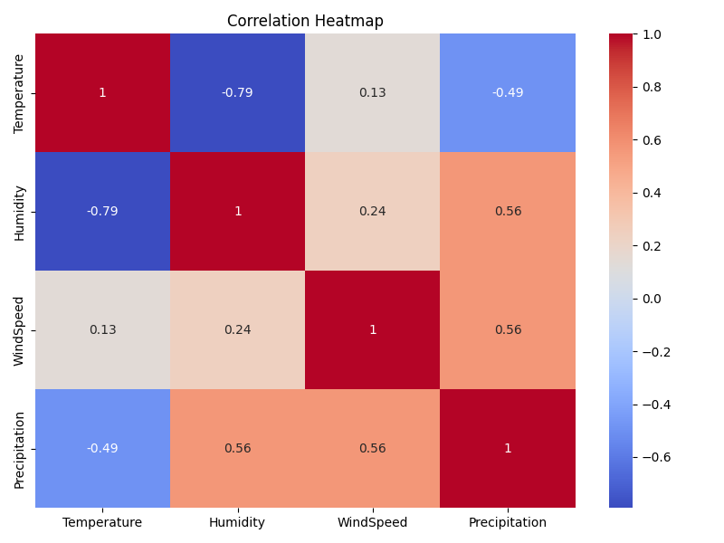
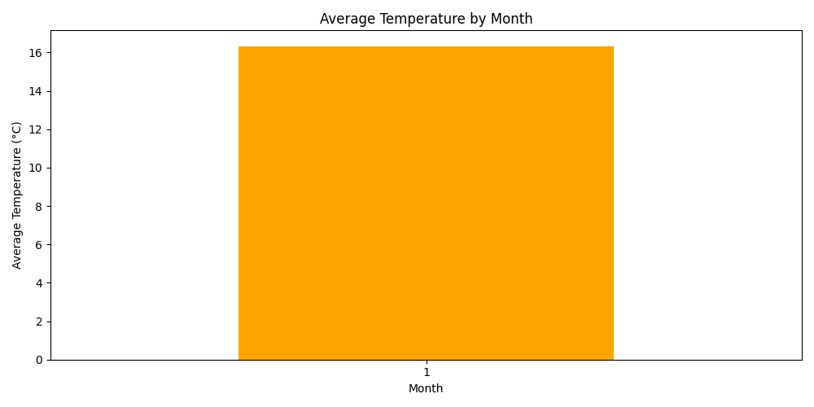
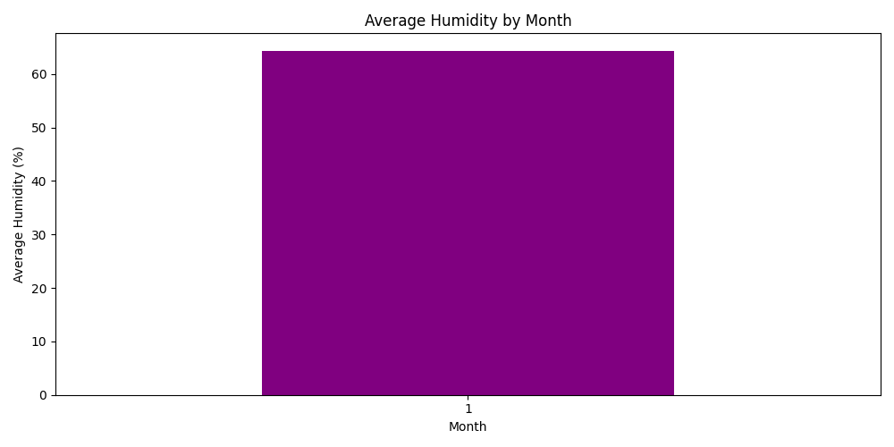

# 🌦️ Weather Data Analysis Project

## 📊 Project Overview

This project analyzes weather data using Python.
It provides insights into temperature, humidity, weather conditions, and correlations between different weather factors.

---

## 🚀 Features

* Data Cleaning & Preprocessing
* Time-based Analysis (Daily Trends)
* Correlation Analysis
* Data Visualization using Matplotlib & Seaborn

---

## 🛠️ Technologies Used

* Python 🐍
* Pandas
* Matplotlib
* Seaborn

---

## 📂 Dataset

* File: `Weather_Data.csv`

Dataset contains:

* Date
* Temperature
* Humidity
* Wind Speed
* Precipitation
* Weather Condition

---

## 📈 Analysis & Visualizations

### 🌡️ Daily Temperature Trend



---

### 💧 Daily Humidity Trend



---

### 🌤️ Weather Condition Frequency



---

### 🔄 Temperature vs Humidity



---

### 🔥 Correlation Heatmap



---

### 📅 Monthly Average Temperature



---

### 📊 Monthly Average Humidity



---

## ▶️ How to Run

1. Install dependencies:

```
pip install pandas matplotlib seaborn
```

2. Run the script:

```
python Weather_python.py
```

---

## 📌 Key Insights

* Temperature and humidity show inverse relationship
* Rainy days have higher humidity and precipitation
* Sunny weather is most frequent
* Strong correlation between humidity and precipitation

---

## 👨‍💻 Author

**Shyam Sitapara**

---

## ⭐ Support

If you like this project, give it a ⭐ on GitHub!

