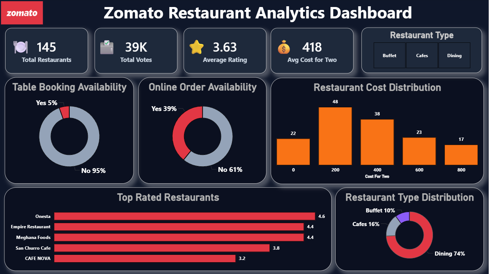

# 🍽️ Zomato Restaurant Analytics Dashboard

## 📊 Project Overview

The **Zomato Restaurant Analytics Dashboard** is an interactive Power BI dashboard designed to analyze restaurant performance, customer preferences, and service availability. This dashboard provides valuable insights into restaurant ratings, online ordering trends, table booking availability, and cost distribution.

---

## 🎯 Objectives

* Analyze restaurant ratings and customer feedback.
* Identify the most popular restaurant types.
* Evaluate online ordering and table booking trends.
* Understand restaurant cost distribution.
* Highlight top-rated restaurants based on customer ratings.

---

## 📈 Key Metrics

* **Total Restaurants:** 145
* **Total Votes:** 39K
* **Average Rating:** 3.63
* **Average Cost for Two:** ₹418

---

## 📌 Dashboard Features

### ✅ Restaurant Overview

* Total Restaurants
* Total Votes
* Average Rating
* Average Cost for Two

### ✅ Service Availability Analysis

* Table Booking Availability
* Online Order Availability

### ✅ Cost Analysis

* Restaurant Cost Distribution

### ✅ Restaurant Type Analysis

* Dining
* Cafes
* Buffet

### ✅ Performance Analysis

* Top Rated Restaurants

---

## 🛠️ Tools & Technologies Used

* Power BI
* Microsoft Excel
* DAX Measures
* Data Cleaning
* Data Visualization

---

## 📷 Dashboard Preview

---

## 📊 Key Insights

* Most restaurants belong to the **Dining** category.
* Online ordering is available in a significant number of restaurants.
* Table booking services are limited across restaurants.
* A few restaurants consistently achieve higher customer ratings.
* Restaurant costs are concentrated around mid-range pricing categories.

---

## 🚀 Skills Demonstrated

* Data Analysis
* Dashboard Design
* Data Visualization
* Business Intelligence Reporting
* KPI Development
* Interactive Reporting

---

## 📬 Connect With Me    

contact me:- www.linkedin.com/in/shyam-sitapara

If you have any suggestions or feedback, feel free to connect with me on LinkedIn and explore more of my Power BI projects.

⭐ If you found this project useful, consider giving it a star!
