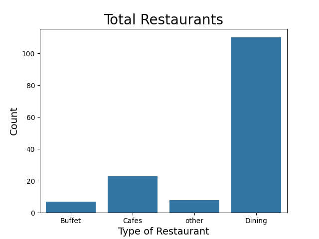
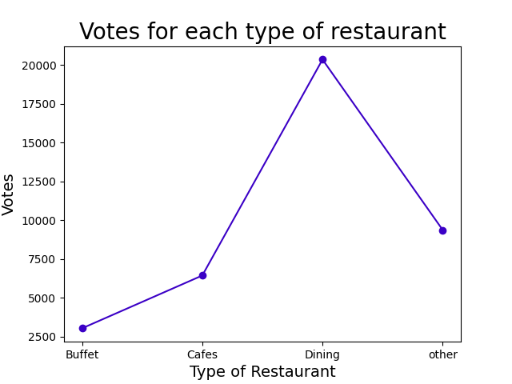
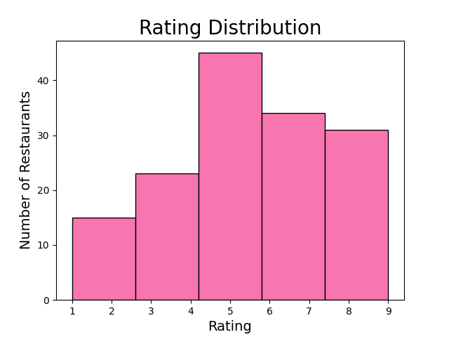
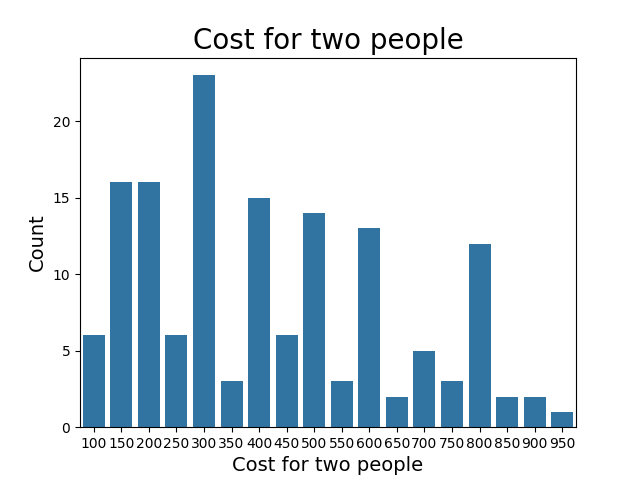
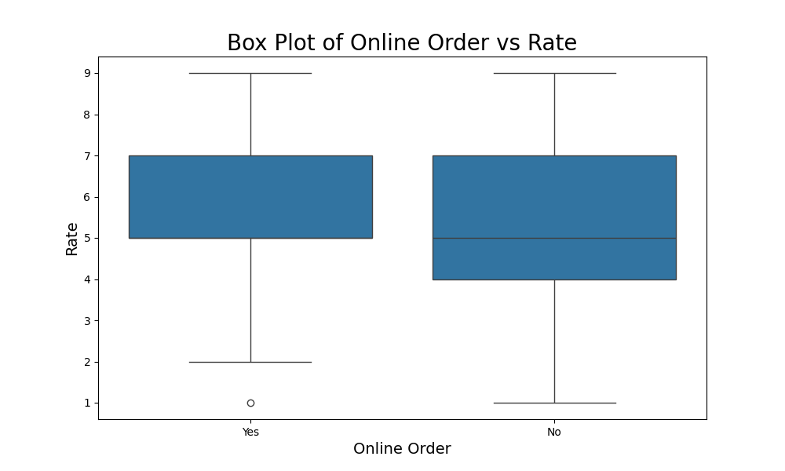
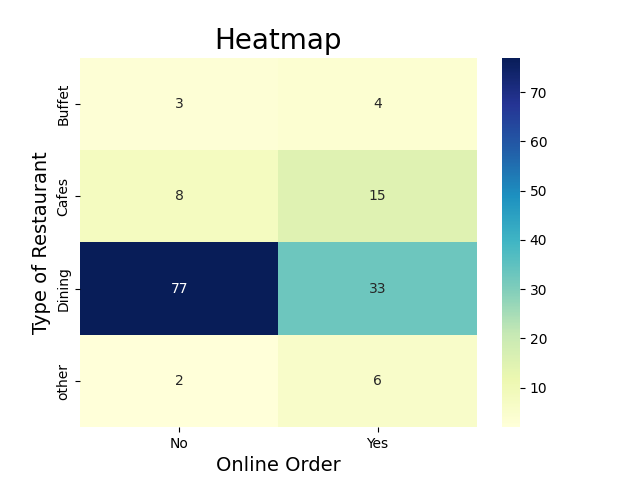

# 🍽️ Zomato Data Analysis Project

## 📊 Project Overview

This project analyzes Zomato restaurant dataset using Python.
It provides insights into restaurant types, ratings, cost, votes, and online ordering trends.

---

## 🚀 Features

* Data Cleaning & Analysis
* Visualization using Matplotlib & Seaborn
* Insightful Graphs

---

## 🛠️ Technologies Used

* Python 🐍
* Pandas
* Matplotlib
* Seaborn

---

## 📂 Dataset

* File: `Zomato_data.csv`

---

## 📈 Analysis & Visualizations

### 🍴 Total Restaurants by Type



---

### 🗳️ Votes by Restaurant Type



---

### ⭐ Rating Distribution



---

### 💰 Cost for Two People



---

### 📦 Online Order vs Rating



---

### 🔥 Heatmap (Restaurant Type vs Online Order)



---

## ▶️ How to Run

1. Install dependencies:

```
pip install pandas matplotlib seaborn
```

2. Run the script:

```
python Zomato_python.py
```

---

## 📌 Key Insights

* Dining restaurants are most common
* Higher votes mostly in dining category
* Ratings mostly range between 4–7
* Online ordering impacts ratings slightly

---

## 👨‍💻 Author

**Shyam Sitapara**

---

## ⭐ Support

If you like this project, give it a ⭐ on GitHub!

